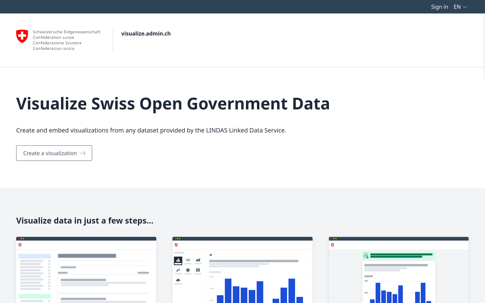

# Visualize

Visualize is a web application to create and embed visualizations from any Swiss
open government dataset provided by the
[LINDAS Linked Data Service](https://lindas.admin.ch/). It is developed by the
[Federal Office for the Environment FOEN](https://www.bafu.admin.ch/en/) and
other Swiss federal authorities and is operated at https://visualize.admin.ch/.

Please
[create an issue](https://github.com/visualize-admin/visualization-tool/issues)
to report a bug or request an enhancement, pull requests are welcome too.

This project is free and open source software, licensed under the terms of the
[BSD-3-Clause](./LICENSE) license.

## General

- [📝 Changelog](./CHANGELOG.md)
- [📖 Public Documentation](https://visualize.admin.ch/docs/) – Design concept,
  chart config & embed API etc.
- [📊 Domain](./readme/domain.md) – Data flow & chart types

## Development

- [🔧 Development Environment](./readme/dev.md) – Local setup
- [🏷️ Releases & Versioning](./readme/versioning.md)
- [🎯 Testing General](./readme/testing-general.md) – Testing strategy, GitHub
  Actions
- [✅ Functional Testing](./readme/testing-functional.md) – Unit tests, E2E
  tests, visual regression tests
- [🏎️ Performance Testing](./readme/testing-performance.md) – GraphQL
  performance tests & load tests
- [🔐 Authentication](./readme/auth.md) – NextAuth, eIAM
- [🌍 Internationalization (I18n)](./readme/i18n.md) – Translation workflow

## Deployment

- Designed for Vercel and Docker deployments
- Database migrations run automatically on production builds
- Environment-specific configuration through environment variables
