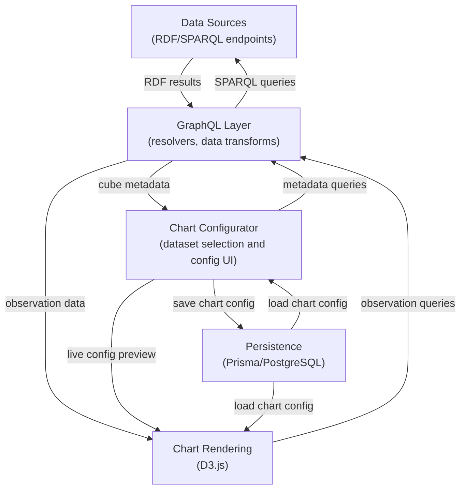

[back](../README.md)

# Domain

## Data Flow

This is how the data flows through the application:

## Supported Chart Types

- Area charts (single and stacked)
- Bar charts (grouped and stacked, horizontal and vertical)
- Line charts (single and multiple)
- Combo charts (line+column, dual-axis, multi-line)
- Maps (with symbols and areas)
- Pie charts
- Scatterplots
- Tables
